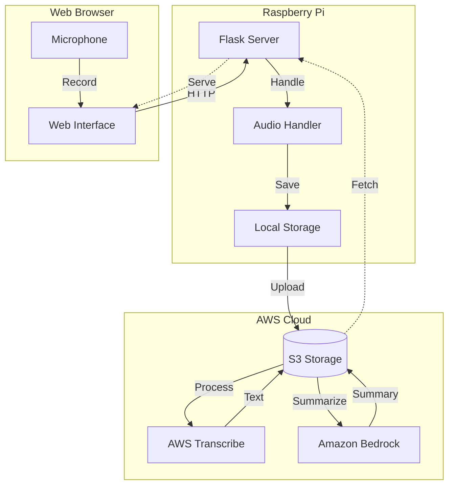
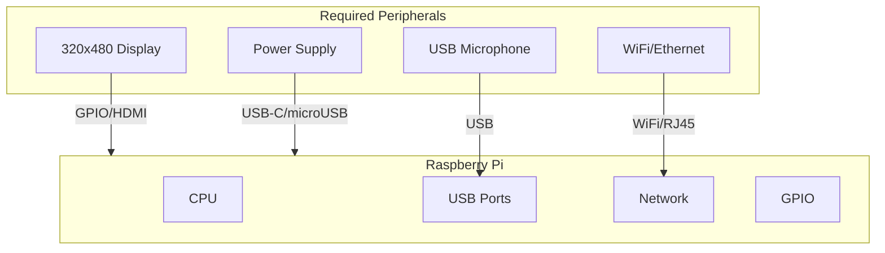
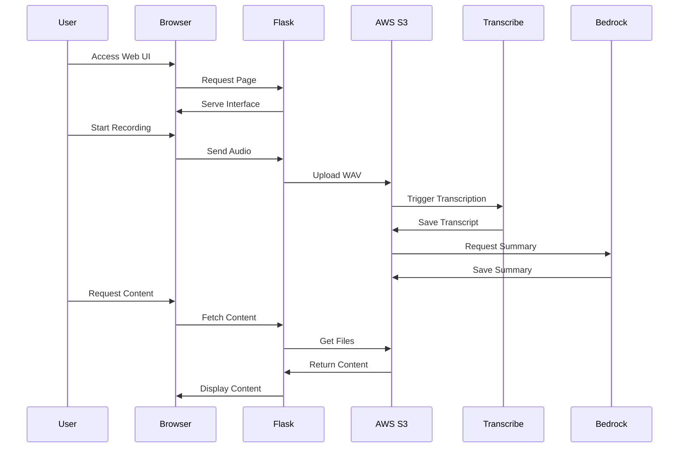

# Audio Recorder & Summarizer

A Flask-based web application designed to run on Raspberry Pi that allows recording, transcribing, and summarizing audio using AWS services. Optimized for small displays (320x480) and embedded devices.

## Architecture



## Device Setup

### Raspberry Pi Requirements

- Raspberry Pi 3 or newer
- Raspbian OS Lite or Full
- Display: 320x480 resolution
- USB Microphone or USB Audio Interface
- 16GB+ SD Card
- Network connectivity

### Hardware Setup Diagram



## Installation

### 1. Raspberry Pi OS Setup

```bash
# Update system
sudo apt update
sudo apt upgrade -y

# Install required system packages
sudo apt install -y \
    python3-pip \
    python3-venv \
    git \
    nginx \
    portaudio19-dev \
    python3-dev \
    libasound2-dev
```

### 2. Application Setup

```bash
# Create application directory
mkdir -p /home/pi/apps
cd /home/pi/apps

# Clone repository
git clone https://github.com/yourusername/audio-recorder.git
cd audio-recorder

# Create virtual environment
python3 -m venv venv
source venv/bin/activate

# Install requirements
pip install -r requirements.txt
```

### 3. AWS Configuration

```bash
# Create AWS credentials directory
mkdir -p ~/.aws

# Create credentials file
cat > ~/.aws/credentials << EOL
[default]
aws_access_key_id = YOUR_ACCESS_KEY
aws_secret_access_key = YOUR_SECRET_KEY
region = YOUR_REGION
EOL
```

## Deployment

### Service Configuration

Create a systemd service for automatic startup:

```bash
sudo nano /etc/systemd/system/audio-recorder.service
```

Add the following content:

```ini
[Unit]
Description=Audio Recorder Web Application
After=network.target

[Service]
User=pi
WorkingDirectory=/home/pi/apps/audio-recorder
Environment=PATH=/home/pi/apps/audio-recorder/venv/bin
ExecStart=/home/pi/apps/audio-recorder/venv/bin/python app.py
Restart=always

[Install]
WantedBy=multi-user.target
```

Enable and start the service:

```bash
sudo systemctl enable audio-recorder
sudo systemctl start audio-recorder
```

### Nginx Configuration

```bash
sudo nano /etc/nginx/sites-available/audio-recorder
```

Add the configuration:

```nginx
server {
    listen 80;
    server_name localhost;

    location / {
        proxy_pass http://localhost:5000;
        proxy_set_header Host $host;
        proxy_set_header X-Real-IP $remote_addr;
    }
}
```

Enable the site:

```bash
sudo ln -s /etc/nginx/sites-available/audio-recorder /etc/nginx/sites-enabled/
sudo nginx -t
sudo systemctl restart nginx
```

## Application Flow



## Directory Structure

```
audio-recorder/
├── app.py                 # Main Flask application
├── requirements.txt       # Python dependencies
├── .gitignore            # Git ignore file
├── README.md             # This file
├── static/               # Static assets
│   └── css/
│       └── style.css
├── templates/            # HTML templates
│   └── index.html
└── venv/                 # Virtual environment
```

## Usage

1. Access the application:

   - Local: `http://localhost:5000`
   - Network: `http://raspberry-pi-ip:80`

2. Enter your S3 bucket name
3. Use the recording controls:

   - Set duration (1-300 seconds)
   - Click "Start Recording"
   - Wait for upload confirmation

4. View files:

   - Audio recordings
   - Transcriptions
   - Summaries

5. Rotate display:
   - Use the rotation button for landscape/portrait

## Troubleshooting

### Common Issues

1. Audio Recording

```bash
# Check audio devices
arecord -l

# Test microphone
arecord -D hw:1,0 -d 5 test.wav
aplay test.wav
```

2. Service Issues

```bash
# Check service status
sudo systemctl status audio-recorder

# View logs
journalctl -u audio-recorder -f
```

3. Permission Issues

```bash
# Fix audio group permissions
sudo usermod -a -G audio www-data
sudo usermod -a -G audio pi
```

### Display Issues

```bash
# Check display configuration
sudo nano /boot/config.txt

# Add for 320x480 display
dtoverlay=<your-display-overlay>
display_rotate=0
```

## Security Considerations

1. Network Security:

   - Use HTTPS (Let's Encrypt)
   - Configure firewall
   - Update regularly

2. AWS Security:

   - Use IAM roles
   - Minimal permissions
   - Rotate credentials

3. Device Security:
   - Change default passwords
   - Disable unnecessary services
   - Keep system updated

## Development

### Local Development

```bash
# Start development server
export FLASK_ENV=development
export FLASK_APP=app.py
flask run --host=0.0.0.0
```

### Testing

```bash
# Install test dependencies
pip install pytest pytest-cov

# Run tests
pytest tests/
```

## License

This project is licensed under the MIT License - see the LICENSE file for details.
